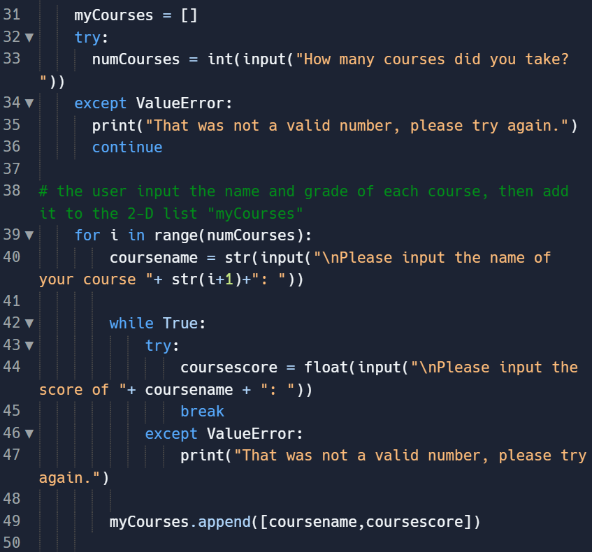
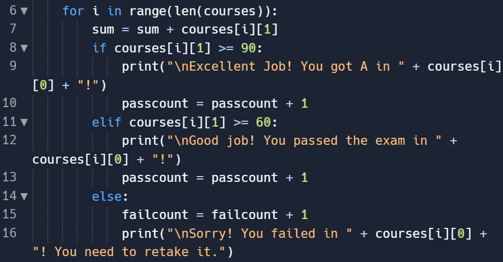
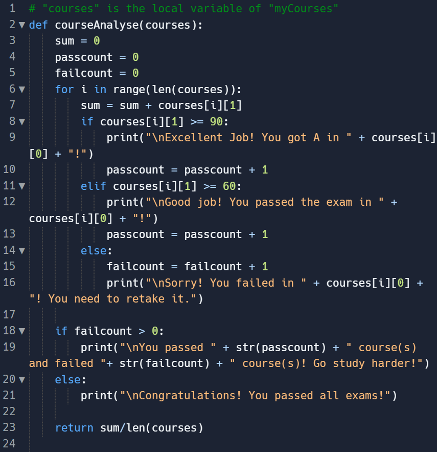
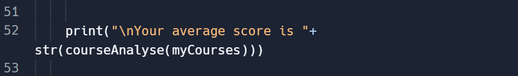

---
title: Create Task Project
layout: template
filename: Create-Task-Project
--- 

# Create Task Project

### [Video](https://drive.google.com/file/d/1O2uYh1ijd3l3l2bimzaWcjsSjLhJJ-sr/view?usp=sharing)
### [Code and Runtime](https://replit.com/@GavinWu3/Create-Task#createtask.py)
### Written Portion
#### 3.a. 
3.a.i. 
The overall purpose of the program is to get a summary of the information about a student’s grades and inform him/her about it.

3.a.ii. 
The video asks the student to input the names of courses he takes and the corresponding grades. It tells the student whether he is passing or failing the course. Then it calculates and displays the average of the grades, and also tells the student how many courses he passed or failed.

3.a.iii.
The user first inputs are if he wants to enter the courses he takes, if yes, he will enter the number of courses and then enter each course name and corresponding grades.The outputs are if the user passes or fails each course, the number of courses he passed and failed, and the average score of all the courses.

#### 3.b. 
3.b.i. 

3.b.ii.

3.b.iii.
The two dimensional list (array) used in the first image has the name “myCourses”. In the second image “myCourses” is accessed within a function as an argument with the local name “courses”.

3.b.iv.
The data contained within the list shown in the image above represents the subject (course name) and the grade (course score). The list is initially empty until the data was input by users and added to the list. 

3.b.v.
The list manages complexity by allowing the user to enter as many course names and grades as he needs. Without the list the program would not be as flexible as before since there would be a limit from the program to how many courses the user can enter, due to needing different variables for each unlike before. Iteration would also not be possible without the list making the overall program very restricting and redundant.

#### 3.c.
3.c.i.

3.c.ii.

3.c.iii.
The identified procedure in the first image checks each course in the list to see whether it passed, failed, or got an A, and adds all the courses grades to get the average score. It also counts how many courses are passed or failed.

3.c.iv.
The function (courseAnalyse) is called with an argument “courses” which stores the course name and scores of all the courses. Three variables “sum”, “passcount” and “failcount” are initialized as 0. When using the “for loop” to  iterate each item of the courses, depending on if the course score is greater than 90, between 60-90, or lower than 60, it displays whether the student passes or fails in the course. At the same time, the variable “sum” gets the sum of each course, the variable “passcount” counts the number of courses passed, and the variable “failcount” counts the number of courses failed. After the loop, it displays the number of passed courses and failed courses, and returns the average score of the courses (sum/the number of courses).

#### 3.d.
3.d.i.
First Call:
The user adds [English, 96.5], [History, 75], [Math, 84.6], [Science, 101], [Elective, 99.2] to the list which is passed as an argument to the function.

Second Call:
The user adds [English, 83.4], [Math, 21.5], [History, 59.9] to the list which is then passed as an argument to the function.

3.d.ii.
Condition(s) Tested by First Call:
The function will calculate the numbers 96.5, 75, 84.6, 101, and 99.2 and find that the average is 91.26. It also checks to see that the grade for English is an A, history is pass, math is pass, science is an A, and elective is an A. It also checks if any course failed, then shows all courses passed.

Condition(s) Tested by Second Call: 
The function will calculate the numbers 83.4, 21.5, and 59.9 then find the average is 54.93. It also checks to see that english is a pass, math is a fail, and history is a fail. It shows 1 course passed and 2 courses failed. It checks if any course failed, then shows 2 failed and 1 passed.

3.d.iii.
Result of the First Call: 
After the user finishes entering all his data the program prints out 
“Excellent Job! You got A in English!

Good job! You passed the exam in History!

Good job! You passed the exam in Math!

Excellent Job! You got A in Science!

Excellent Job! You got A in Elective!

Congratulations! You passed all the exams!

Your average score is 91.26”

Result of the Second Call:
After the user finishes entering all his data the program prints out
“Good job! You passed the exam in English!

Sorry! You failed in Math! You need to retake it.

Sorry! You failed in History! You need to retake it.

You passed 1 course(s) and failed 2 course(s)! Go study harder!

Your average score is 54.93333333333334”
